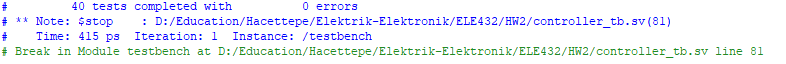
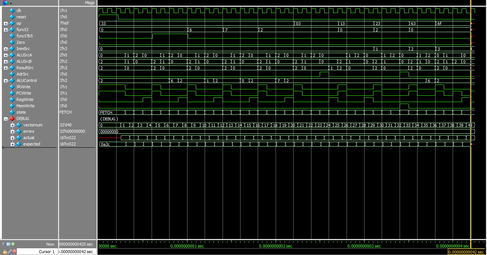
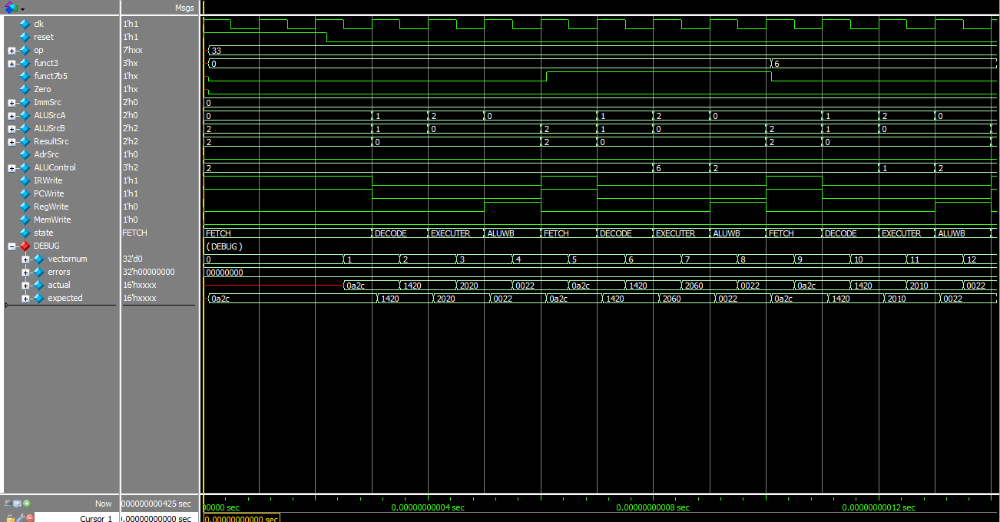
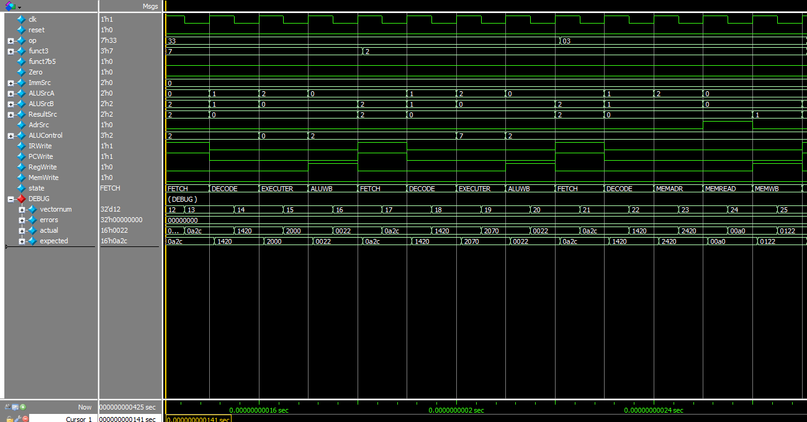
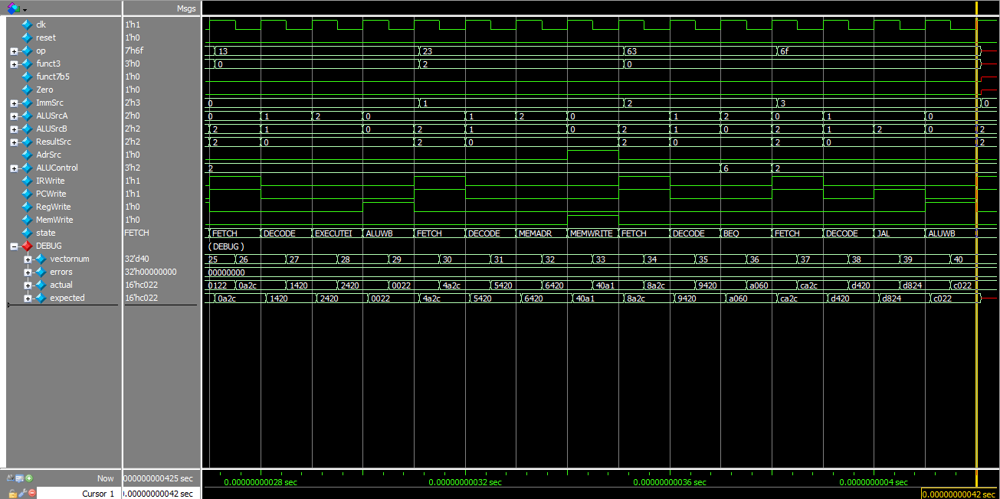

# ELE 432 HW 2: Multicycle Processor Controller

**Author:** Ali Özyüksel  
**Institution:** Hacettepe University, Department of Electrical and Electronics Engineering  
**Course:** ELE 432 Digital Design & Computer Architecture  

---

## Project Description
This repository contains the SystemVerilog implementation of a **Multicycle RISC-V Processor Controller**. This project was developed as Homework 2 for the ELE 432 course. The focus of this homework is strictly on the control unit of the multicycle processor, which generates the necessary control signals for the datapath over multiple clock cycles.

The controller consists of an 11-state Finite State Machine (FSM), an ALU Decoder, and an Instruction Decoder. It is designed to support the execution of the following base RISC-V instructions:
* `lw`, `sw`
* `add`, `sub`, `and`, `or`, `slt`, `addi`
* `beq`, `jal`

## Repository Modules
The controller logic is hierarchically divided into the following SystemVerilog files:
* **`controller.sv`**: The top-level wrapper module that instantiates the FSM and the decoders.
* **`mainfsm.sv`**: The core 11-state FSM that transitions through FETCH, DECODE, EXECUTE, MEMORY, and WRITEBACK stages depending on the instruction.
* **`aludec.sv`**: Generates the 3-bit `ALUControl` signal based on `ALUOp` (from the FSM), `funct3`, and `funct7b5`.
* **`instrdec.sv`**: Evaluates the 7-bit opcode to determine the `ImmSrc` signal for immediate extensions.

---

## Verification Strategy & Test Vectors
The design is verified using a provided testbench (`controller_testbench.sv`) and a test vector file (`controller.tv`). The test vector file systematically checks the controller's outputs across all supported instructions and their respective multi-cycle FSM states.

Each row in the test vector checks the following format against our controller's outputs:
`{Op}_{Funct3}_{Funct7b5}_{Zero}__{ImmSrc}_{ALUSrcA}_{ALUSrcB}_{ResultSrc}_{AdrSrc}_{ALUControl}_{IRWrite}_{PCWrite}_{RegWrite}_{MemWrite}`

During the simulation, the testbench compares the **`expected`** signals (read from the `.tv` file) with the **`actual`** signals generated by our SystemVerilog modules. 

---

## Simulation Results & Waveform Analysis

The simulation successfully processed all test vectors with **0 errors**. The matching of `actual` and `expected` signals indicates that the state transitions and control outputs are flawlessly aligned with the RISC-V multicycle architecture specifications. 

*Note: The `debug` signal group in the waveforms is used to verify whether we have the correct values in each execution step, rather than checking each individual signal manually.*

### 1. Terminal Output
The transcript shows that the testbench completed all tests without encountering any mismatches.

### 2. Overall Simulation Waveform
The figure below shows the whole output. You can observe that the simulation ends with the `vectornum` signal reaching **40**, which means the processor successfully accomplished all 40 test steps defined in the test vector file.

### 3. Execution of `add`, `sub`, and `or` Instructions
This waveform specifically highlights the execution of the R-Type instructions `add`, `sub`, and `or`. Each of these instructions takes 4 clock cycles (Fetch $\rightarrow$ Decode $\rightarrow$ ExecuteR $\rightarrow$ ALUWB).

### 4. Execution of `and`, `slt`, and `lw` Instructions
This waveform section shows the `and` and `slt` instructions, followed by the `lw` (load word) instruction. Notice how the `lw` instruction uniquely takes 5 clock cycles to complete (Fetch $\rightarrow$ Decode $\rightarrow$ MemAdr $\rightarrow$ MemRead $\rightarrow$ MemWB).

### 5. Execution of `addi`, `sw`, `beq`, and `jal` Instructions
The final section of the waveform displays the execution of `addi` (4 cycles), `sw` (4 cycles), `beq` (3 cycles), and `jal` (4 cycles). The `expected` and `actual` signal groups perfectly match across all unique FSM paths.

---

## How to Run
To run the simulation yourself:
1. Clone the repository.
2. Compile all `.sv` files in ModelSim/QuestaSim.
3. Start the simulation by loading the `controller_testbench` module.
4. Add the signals to the wave window and type `run -all` in the transcript.
